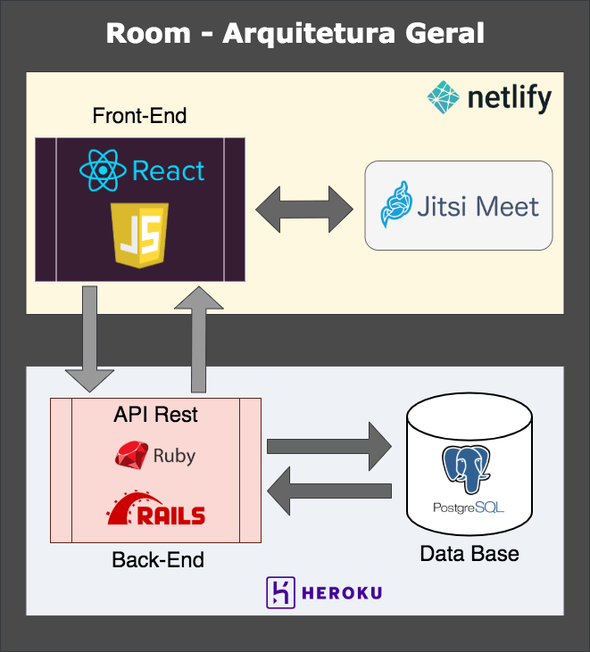
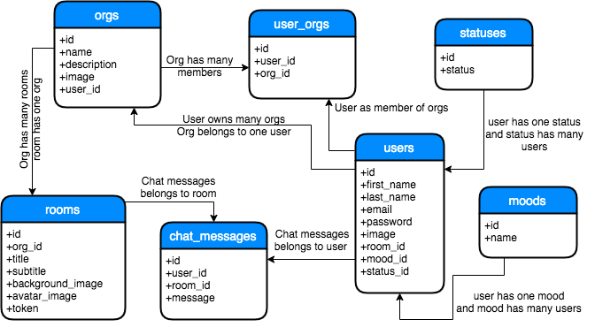
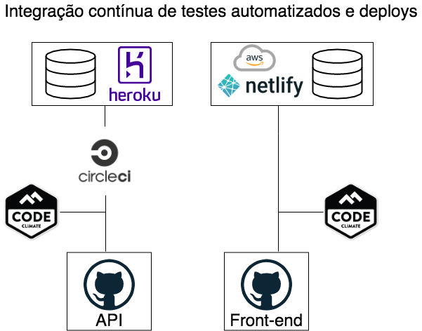
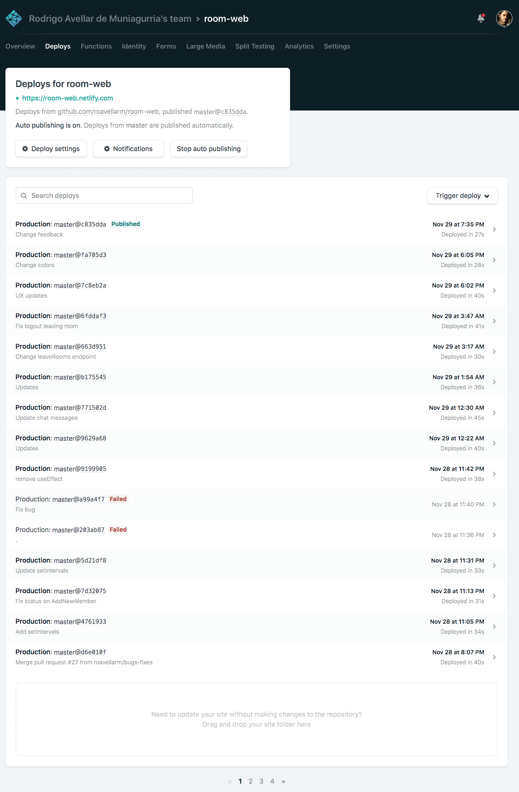

[<- Voltar ao menu](README.md#artefatos-do-projeto)

# Arquitetura

## Modelo de Arquitetura

## Visão Lógica

### Diagrama de Classes e Banco de Dados

O diagrama de classes abaixo apresenta as principais entidades (modelos/tabelas) 
do sistema e suas respectivas relações.

## Integração contínua

Para facilitar o processo de deployments e testes automatizados, visando
reforçar a qualidade e funcionamento do sistema, foram criadas integrações de plataformas de deployment e integração contínua como CircleCi
e [Netlify](https://www.netlify.com/) com os repositórios de back-end e
front-end respectivamente.

 

[Aqui](https://circleci.com/gh/roavellarm/room-api) pode ser visto os previews de deploys realizados ao longo do desenvolvimento da API.

Netlify não possui um link público de acesso aos previews de deploys, a
seguir é apresentado um print de exemplo:

