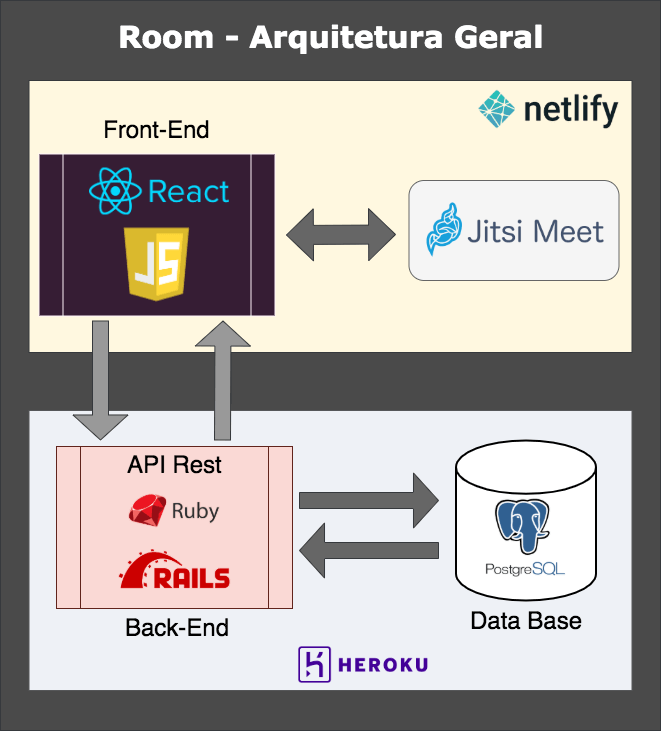

[<- Voltar ao menu](/README.md#artefatos-do-projeto)


# Arquitetura

## Modelo de Arquitetura



## Visão Lógica

### Diagrama de Classes e Banco de Dados

O diagrama de classes abaixo apresenta as principais entidades \(modelos/tabelas\) do sistema e suas respectivas relações.


### ORM

O Ruby on Rails conta com mapeamento objeto-relacional \(ou ORM, do inglês: Object-relational mapping\) que facilita o processo de desenvolvimento, não sendo necessário recorrer à programação de queries em linguagen SQL. As tabelas do banco de dados são representadas através de classes e os registros de cada tabela são representados como instâncias das classes correspondentes.

Nos trechos de código abaixo podemos observar a forma como foram programadas as relações entre as entidades:

```ruby
# USER model
  has_many :messages
  has_many :orgs
  has_many :user_orgs, dependent: :destroy
  has_many :orgs_as_member, source: :org, through: :user_orgs
  belongs_to :room, optional: true
  belongs_to :mood, optional: true
  belongs_to :status, optional: true

# ORG model
  belongs_to :user
  has_many :rooms, dependent: :destroy
  has_many :user_orgs, dependent: :destroy
  has_many :members, source: :user, through: :user_orgs

# USER-ORG
# Classe criada para definir a relação de User como membro (member) de uma Org 
# e não como dono (owner)
  belongs_to :user
  belongs_to :org

# ROOM model
  belongs_to :org
  has_many :users
  has_many :messages

# STATUS model
  has_many :users, dependent: :destroy

# MOOD model
  has_many :users

# CHAT(messages) model
  belongs_to :user
  belongs_to :room
```

As classes _faq_, _feedback_, e _admin texts_ não tem relação com outras classes, pois são utilizadas meramente para coleta de dados ou atualizações futuras do site via painel de usuário administrador do site.

## Integração contínua

Para facilitar o processo de deployments e testes automatizados, visando reforçar a qualidade e funcionamento do sistema, foram criadas integrações de plataformas de deployment e integração contínua como CircleCi e [Netlify](https://www.netlify.com/) com os repositórios de back-end e front-end respectivamente.


[Aqui](https://circleci.com/gh/roavellarm/room-api) pode ser visto os previews de deploys realizados ao longo do desenvolvimento da API.

Netlify não possui um link público de acesso aos previews de deploys, a seguir é apresentado um print de exemplo:


