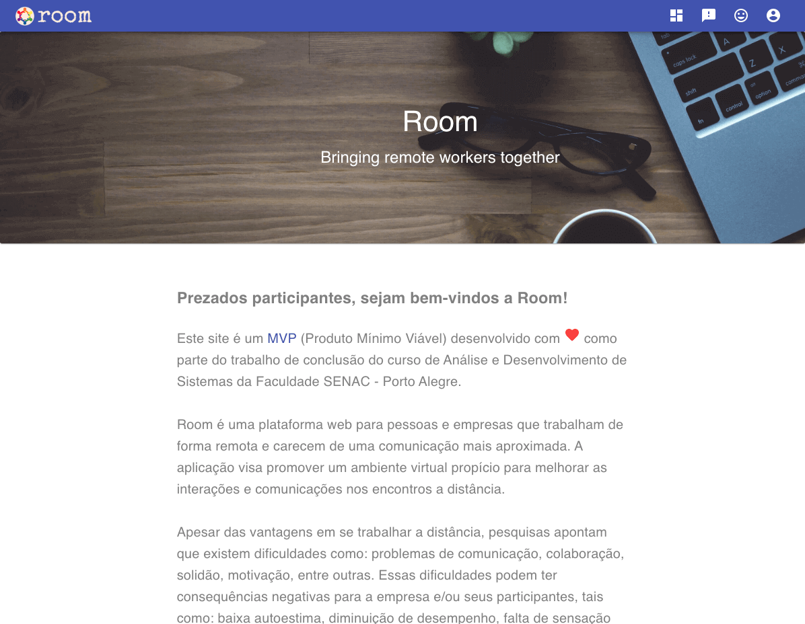
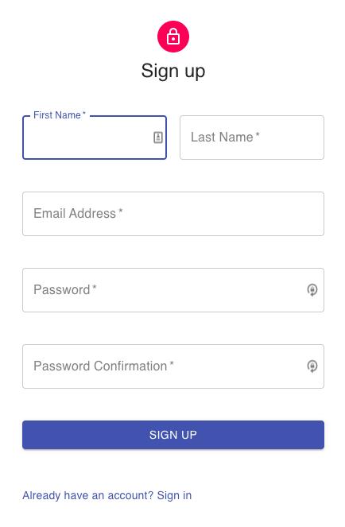
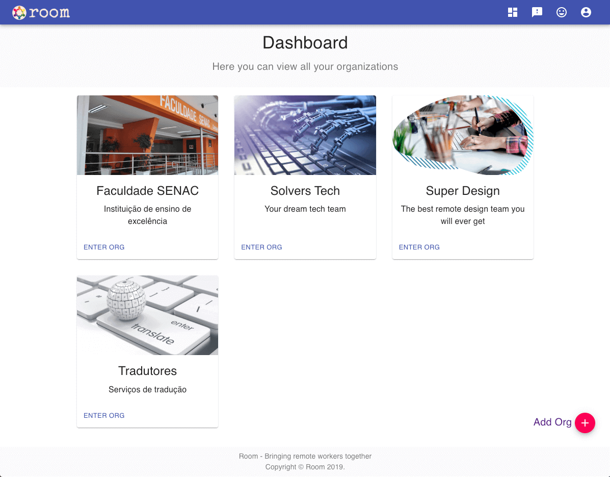
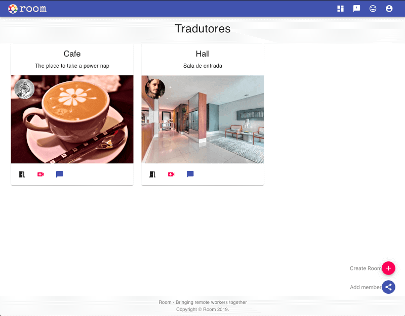
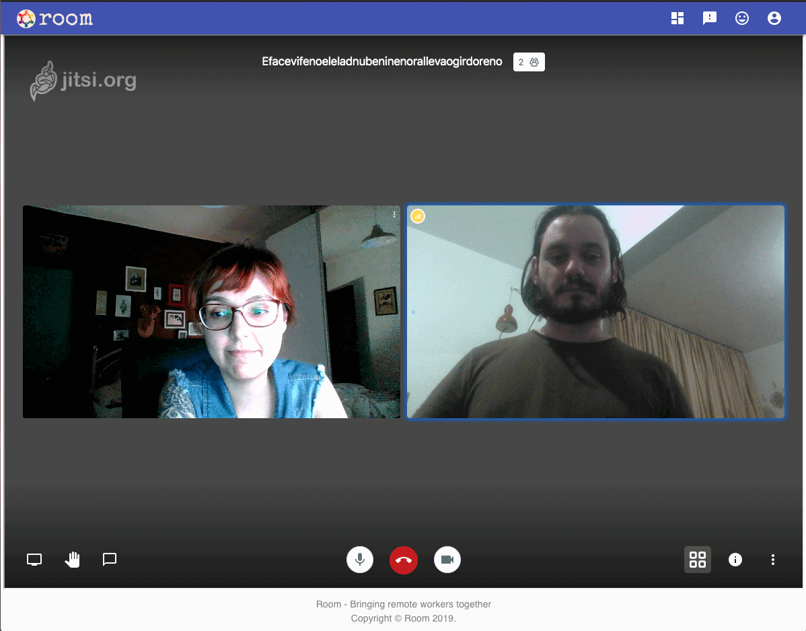
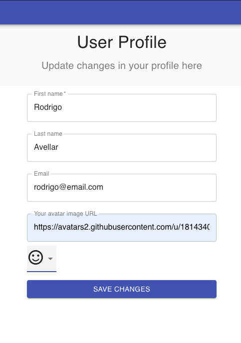
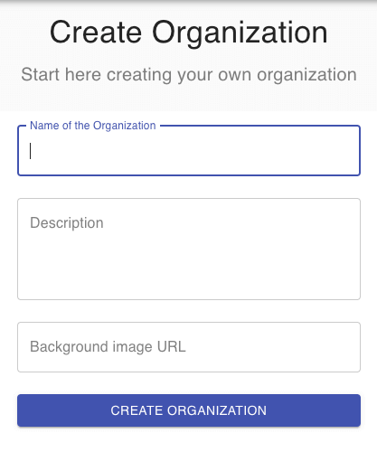
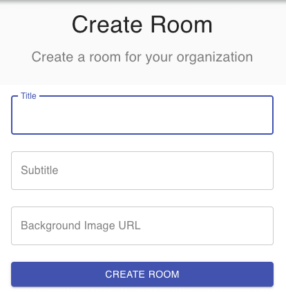
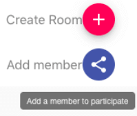
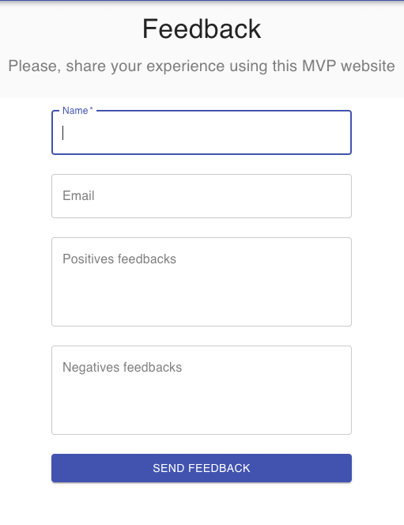

[<- Voltar ao menu](/README.md#artefatos-do-projeto)

# Telas do sistema

Abaixo podem ser visualizadas as páginas da aplicação com suas respectivas funcionalidades.

## Página de Homepage

## Página de Sign in

## Página de Sign up

## Página do Dashboard

## Página da Organização

## Videoconferência

## Página de Chat

## Página User Profile

## Formulário criação de organização

## Formulário de criação de sala

## Botões de criar sala e adicionar membro

## Formulário de adição de membro em organização

## Formulário de feedback

