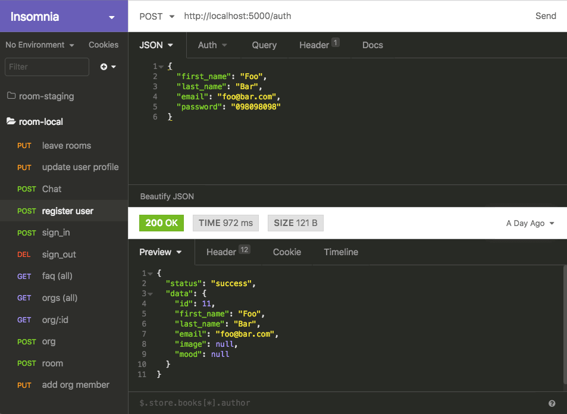

[<- Voltar ao menu](/README.md#artefatos-do-projeto)

# Testes e Validação

Os testes e validação da API se deram através da programação de testes automatizados, seguindo processo de desenvolvimento orientado a testes \(TDD\). O TDD é baseado na repetição ciclos de desenvolvimento curtos, onde cada requisito é transformado em caso de teste específico e, em seguida, o software é aprimorado para que os teste passe.

As classes de testes que foram desenvolvidas podem ser encontradas no diretório [spec](https://github.com/roavellarm/room-api/tree/master/spec) no repositório da API.

Também foram realizados testes de todos os endpoints atuais da API com o REST Client Insomnia.

