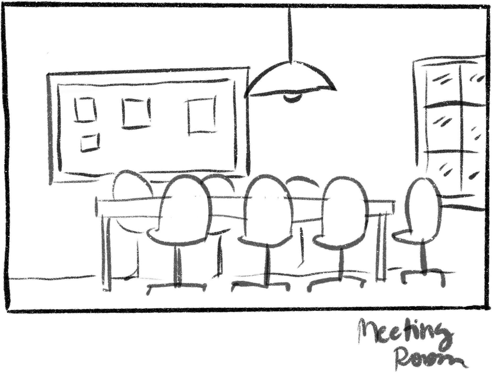
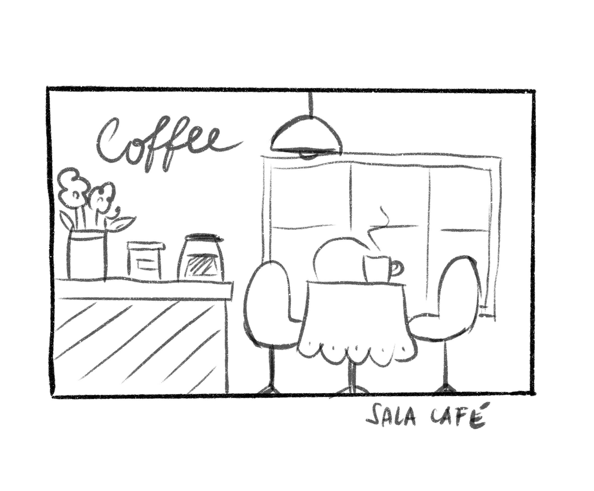

[<- Voltar ao menu](README.md#artefatos-do-projeto)

# Design e wireframes do projeto

- Foram criados e utilizados componentes a partir do framework 
[material-ui](https://material-ui.com/) majoritariamente, em poucos casos foi 
utilizado Html e CSS puro.

- Foi realizado um estudo de [tamanho de telas](https://www.figma.com/file/IbrhmOXkLLBB37PmNGmyzc/TCC-Room?node-id=0%3A1) a serem consideradas para o desenvolvimento. Devido ao curto 
prazo para o desenvolvimento, focou-se apenas na versão na tela mais comuns de 
desktops e mobile. Segundo dados de estatísticas, as mais utilizadas são:
  - 1º 1366 x 768 pixels
  - 2º 360 x 640 pixels
  - 3º 1920 x 1080 pixels

- Foram desenvolvidos [protótipos de telas e componentes](https://www.figma.com/file/IbrhmOXkLLBB37PmNGmyzc/TCC-Room?node-id=20%3A42) 
visuais do app. A figura abaixo ilustra um modelo inicialmente pensado para a visualização das 
salas de na tela de uma organização.

- Foi criado o [logo do app](https://www.figma.com/file/IbrhmOXkLLBB37PmNGmyzc/TCC-Room?node-id=87%3A199)
utilizando a ferramenta [Figma](https://www.figma.com/)

## Arte
A arte e desenhos presentes no sistema contou com a colaboração da ilustradora 
[Samanta Flôor](https://www.samantafloor.com.br/). Abaixo podem são apresentados
as imagens utilizadas na aplicação.

#### Meeting room

#### Hall

#### Sala do café

#### Bot Dogo

#### Bot Dogo Blocking

#### Bot Dogo latindo

#### Bot Dogo falando

