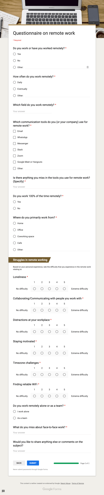

[<- Voltar ao menu](README.md#artefatos-do-projeto)

# Pesquisa para validar hipótese

### Questionário (versão em português) - Seção 1

### Questionário (versão em português) - Seção 2

### Questionnaire (english version) - Seção 1

### Questionnaire (english version) - Seção 2
