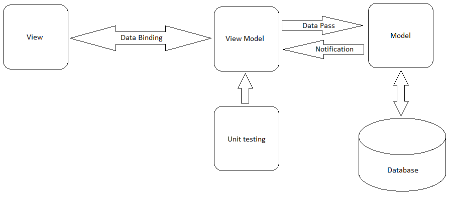

# Representação da Arquitetura

## Modelo de Arquitetura

O modelo de arquitetura adotado foi MVC...

Explicar a lógica entre as camadas...

* A
* B
* C
* D

Explicar as abstrações das camadas \(ou seja, cada camada e "explodir"\)

## Visão Lógica
TODO

### Diagrama de Classes
TODO

### Banco de Dados
TODO
