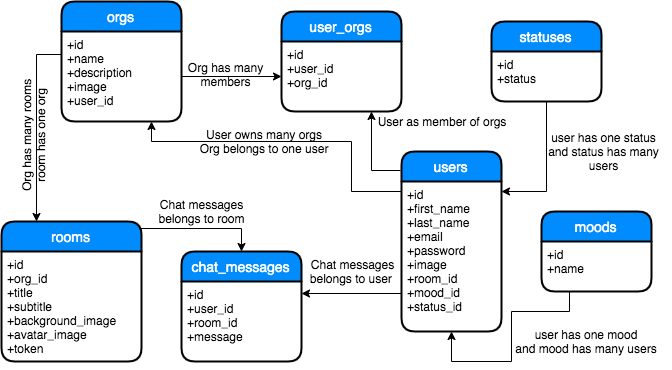

[<- Voltar ao menu](README.md#artefatos-do-projeto)

# Representação da Arquitetura

## Modelo de Arquitetura

Explicar as abstrações das camadas \(ou seja, cada camada e "explodir"\)

## Visão Lógica
TODO

### Diagrama de Classes e Banco de Dados

O diagrama de classes abaixo apresenta as principais entidades (modelos/tabelas) 
do sistema e suas respectivas relações.

